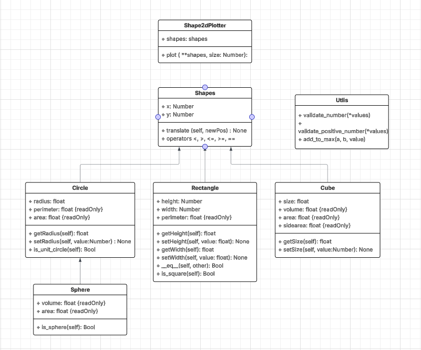

# lab 2 Felix_Kjellberg
The purpose of this lab is to use object-oriented programming in Python to reuse code and design well-structured programs.

## UML

This was the final draft of the UML which I worked from after completing task one. It did help me a lot with figuring out where to start with my code and also what needed to be included in each class. 
## Shapes
I wanted to create a modular code which you can add new shapes and keeping to the DRY principle as much as possible. So I started with a shape class that only had x and y values for positioning the shapes. 

I then started building the circle and rectangle shapes with their attributes. I reliazed somewhere her that i probably wanted to have the comparison operators in the shape class.
## Plotter

## Tests